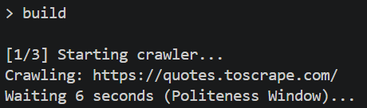
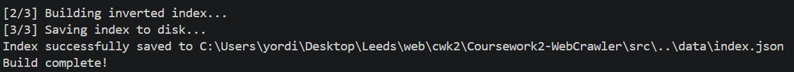
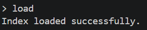
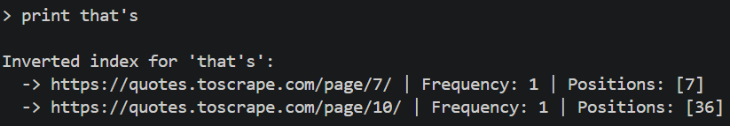
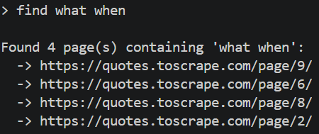

# Coursework2-WebCrawler
Coursework 2 for Web services and web data. Author: Jorge Reyes Rojas


# Dependencies

This project uses Python 3.14.2

The external libraries used are:
* `requests 2.33.1`
* `beatifulsoup 4.14.3`

# Installation

1. Clone repository and navigate to folder

```
cd Coursework2-WebCrawler
```
2. (Optional but Recommended) Create a virtual environment to keep dependencies isolated:

```
python -m venv venv
venv\Scripts\activate
```
3. Insstall the required dependencies using pip:
```
pip install -r requirements.txt
```

# Usage

To start the search tool's interactive Command-Line Interface (CLI), run the main script from the root directory:

```
python src/main.py
```

Once the shell is running, you can use the following four commands:

1. build

Instructs the search tool to crawl the website, build the inverted index, and save it to the file system (data/index.json).
Note: Because of the required 6-second politeness window between page requests, this process will take about a minute to complete.


2. load

Loads the previously generated index from the file system into memory. This allows you to search without having to recrawl the website every time you start the program.


3. print <word>

Prints the inverted index statistics (frequency and exact positions) for a specific word across all crawled pages. It supports words with apostrophes.



4. find <phrase>

Finds and returns a list of all URLs that contain all the words in your provided query phrase.



# Testing instructions

The project includes a suite of unit tests for the crawler, indexer, and search engine. The tests utilize Python's unittest.mock library to simulate HTTP responses and bypass the 6-second politeness delay, ensuring the test suite runs instantly without hitting the live web server.

To run the entire test suite, ensure you are in the root directory of the repository and execute:

```
python -m unittest discover -s tests
```

